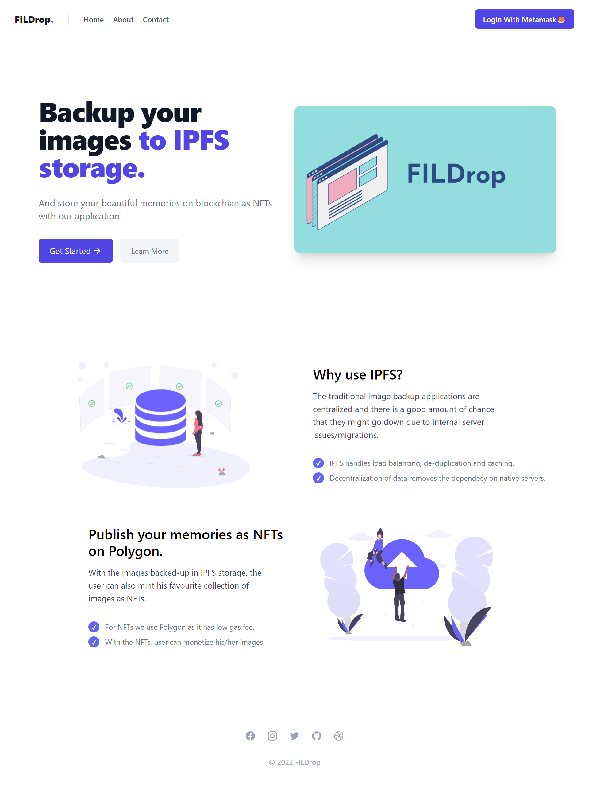
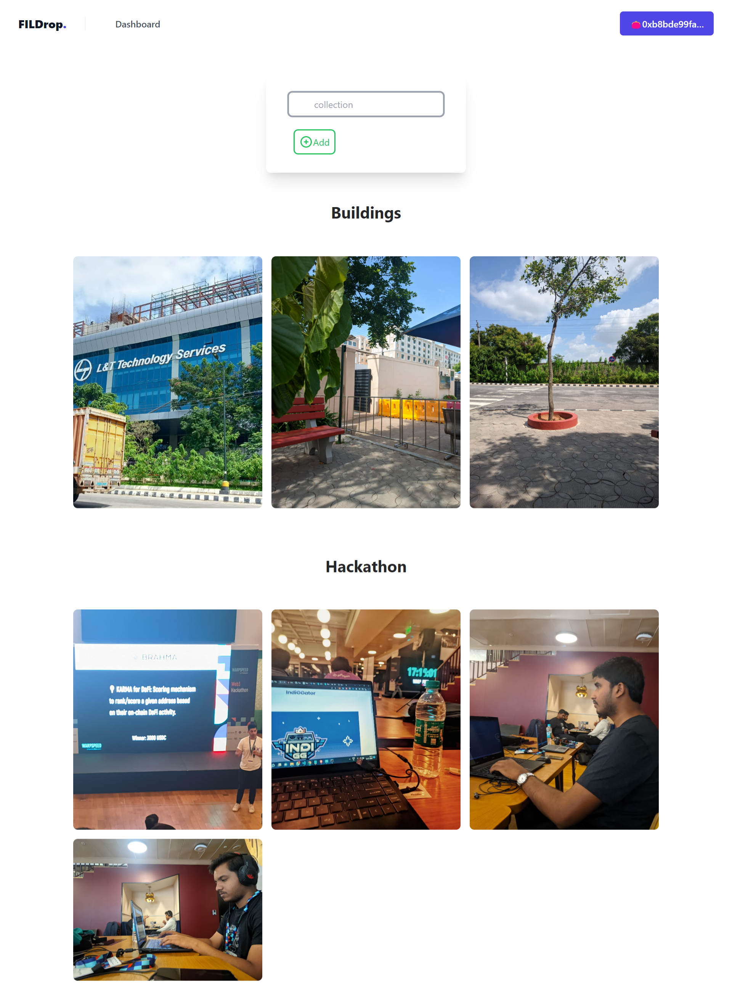

# FilDrop

Backup your images to IPFS storage and convert them into NFTs.


## Clone this repo

```bash
git clone https://github.com/meta-ps/FilDrop/
```

## Run

Make sure you have `python` and `Django` install then run

```python
npm i
python manage.py makemigrations FilDrop
python manage.py migrate
python manage.py runserver
```

## UI

### Home Page




### Dashboard



## Usage of Technologies

### IPFS

The following python code is used for IPFS upload:
https://github.com/meta-ps/FilDrop/blob/master/utility/nftstorage.py

### Polygon

The following smart contract is used to deploy the NFT:
https://github.com/meta-ps/FilDrop/blob/master/contracts/NFT.sol

Hardhat Configuration for Polygon-Mumbai Testnet:
https://github.com/meta-ps/FilDrop/blob/master/scripts/deploy.js
